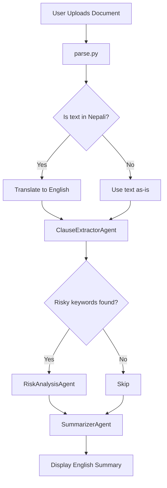

# 🧾 Legal Document Reviewer (Multi-Agent System)

This project is a multi-agent system for reviewing legal documents, designed to extract important legal clauses, analyze risk, and provide a plain English summary. It supports both English and Nepali documents and includes auto-translation functionality.

---


## 🧠 System Overview


## 🚀 Features

- 📄 Upload legal documents (PDF, DOCX, or image)
- 🔍 Detects if content is in Nepali and translates to English
- 🤖 Multi-agent system:
  - Clause extraction agent
  - Risk analysis agent (only if risky terms are found)
  - Summarization agent
- 🗣️ Supports English and Nepali documents
- 🌐 Deployed with Gradio (can be shared or hosted on Hugging Face Spaces)

---

## 🧠 Technology Stack

- **Gradio** – Web interface
- **AutoGen** – Agent communication
- **pymupdf4llm** – PDF to markdown parser
- **docx** – DOCX parser
- **Ollama** – Vision model for image text extraction
- **Custom translation pipeline** – Translates Nepali to English
- **Langdetect / Regex** – Language detection logic

---

## 📁 File Structure

```
.
├── app.py                   # Gradio UI for user interaction
├── agent.py                 # Main multi-agent pipeline logic
├── parse.py                 # Parses files and handles translation
├── markdown_loader.py       # Provides LLM prompts for each agent task
├── model_adapter.py         # Model connection helper
├── model_prompt/            # Prompt definitions for each agent
├── translation_model/       # Contains run_translation_pipeline logic
├── requirements.txt         # Required packages
└── README.md                # This file
```

---

## 🔁 Workflow Overview



---

## 📜 Extracted Clauses

The clause extractor attempts to extract:

- Parties involved
- Effective date and term
- Scope or Purpose
- Payment and Compensation
- Confidentiality / NDA
- Termination
- Governing law
- Liability
- Warranties
- Force majeure
- Dispute resolution
- Assignment
- Modification
- Entire agreement
- Severability
- Notices
- Execution / Signatures

---

## 🧪 How to Run Locally

1. 📦 Install dependencies:

```bash
pip install -r requirements.txt
```

2. ▶️ Launch Gradio:

```bash
python app.py
```

3. 🌐 Visit:

```
http://localhost:7860
```

Or use the Gradio public share link if enabled.

---

## 🌍 Deploying to Hugging Face Spaces

1. Install CLI and login:

```bash
pip install gradio
huggingface-cli login
```

2. Deploy:

```bash
gradio deploy
```

This will give you a **permanent live URL** to share your Gradio app with others.

---

## 🧾 Language Support

- ✅ English
- ✅ Nepali (auto-translated)
- ❌ Any other language will show: "Sorry, we currently only support English and Nepali."

---

## 📸 Example Use Case

- Upload a **scanned legal document in Nepali**
- Automatically **translated to English**
- Extracted and summarized into a clean plain English summary
---

## 🛠️ Future Improvements
- Support for highlighting risky clauses
- FastAPI or Streamlit deployment

---

## 📄 License

This project is for educational and research purposes only. Not intended for legal advice or commercial production use.
